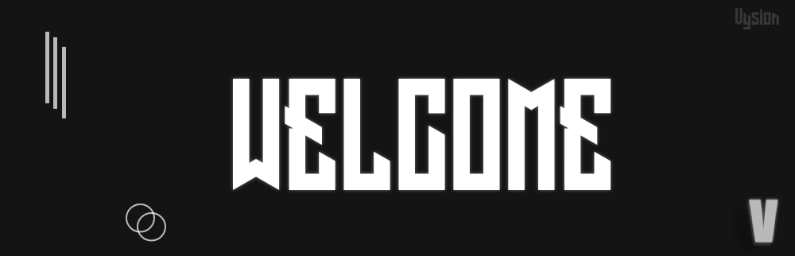

Welcome to Vysion's documentation!
=========================================

.. toctree::
   :maxdepth: 2
   :caption: Contents
   :hidden:

   introduction
   usercmds
   admincmds

Getting Started
---------------
Here are a few links to help you get started.

- First steps :doc:`/introduction`
- User Commands :doc:`/usercmds`
- Admin commands :doc:`/admincmds`

Getting help
------------
- If you need help with anything, you are welcome to join our `discord support server <https://bit.ly/vysion-support>`_.
- If you are looking for something specific, try to search something by `Index <https://vysion-docs.readthedocs.io/en/latest/genindex.html>`_.
